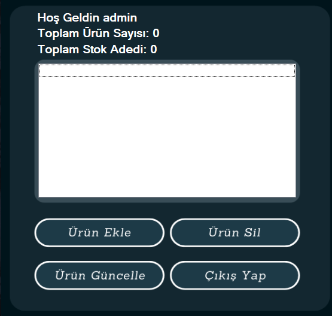

# 📦 Stok Takip Sistemi

Bu proje, **C# Windows Forms** kullanılarak geliştirilmiş bir **Stok Takip Sistemi** uygulamasıdır. Kullanıcılar, sistem üzerinden mevcut ürünleri listeleyebilir, ürün ekleyebilir, silebilir ve güncelleyebilir. Proje eğitim amaçlıdır.

## 🧩 Özellikler

- Mevcut ürünleri listeleme
- Ürün ekleme, silme ve güncelleme işlemleri
- Ürün detaylarını görüntüleme
- Basit ve kullanıcı dostu arayüz

## 🛠️ Kullanılan Teknolojiler

- C# (Windows Forms)
- .NET Framework
- Visual Studio
- (Opsiyonel: JSON, XML ya da SQL Server ile veri saklama)

## 🖼️ Uygulama İçi Ekran Görüntüleri

